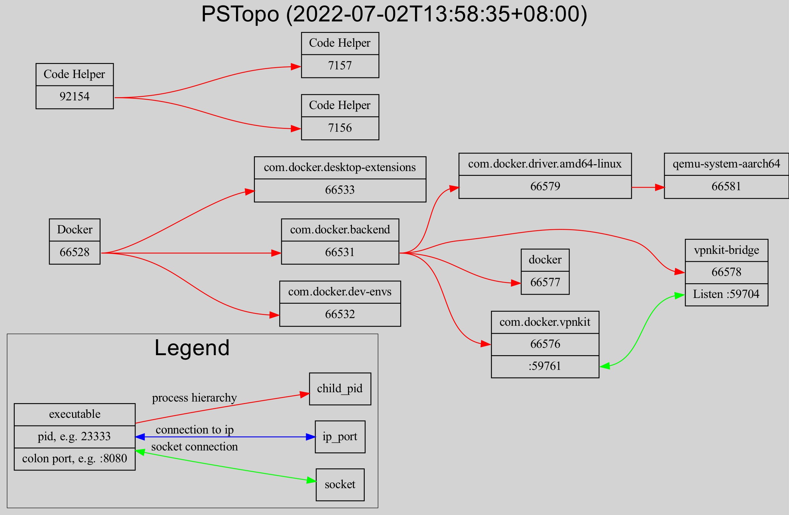

# PSTopo
Generate topo of process, including process status, port, ~~fd~~, etc.

# Workflow
- take a snapshot (`snapshot.json`) of current system info using `psutil`, including
  - process
  - net connection
- analyse to match target using config (`config.json`) and arguments.
- output the `dot` file (`output.dot`), including
  - process relationship (pid, cmdline, port)
  - connection info (listen port and host)
  - etc.

# Install
```shell
go install github.com/FFengIll/pstopo@latest
```

# Sample



# Usage
## pstopo
Creating a topo can work with process name, port number or pid number.
All the matches will be output.

```sh
# auto generate snapshot, and filter them to output the output.dot
# if no snapshot, pstopo will take one
pstopo process_name :port_number pid

# specific existed snapshot and existed topo (config)
pstopo -s snapshot.json -t topo.json

# dynamic add config items
pstopo -s snapshot.json -t topo.json -o output_dir/sub_dir :8080 zsh
```

~~Furthermore, if the number is a name, use `-n` or `--name` for it.~~

## pstopo reload
`pstopo reload` to reload exist snapshot and edit output via config in dynamic.

```shell
# reload
pstopo reload your_ouput_dir more_option

# with `-w`, pstopo will overwrite config.json
pstopo reload your_ouput_dir -w more_option

# e.g.
pstopo reload ./sample -w zsh
```

## pstopo snapshot
`pstopo` can take a snapshot for current system status,
then we can get topo from it and never lost original info (or changed while restart and so on).

```sh
pstopo snapshot -o your_name.json
```


## template (WIP)
The `pstopo` use `dot` (aka `graphviz`) as default output, and then to svg / png / etc.

Using `dot`, pstopo will allow to customize output style for different information.

Template engine `text/template` is used and work with some inline variable as bellow
- port
- pid
- cmdline

# Features
- [x] analyse information of system process and port
- [x] search and match information
- [x] build a topo graph of the match
- [x] output topo graph using graphviz
- [x] serialize and deserialize process information (as snapshot)
- [x] support template
- [ ] support customize template (for some info only)

# License
[MIT](LICENSE).